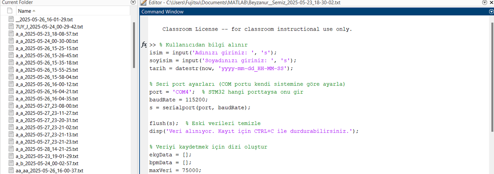
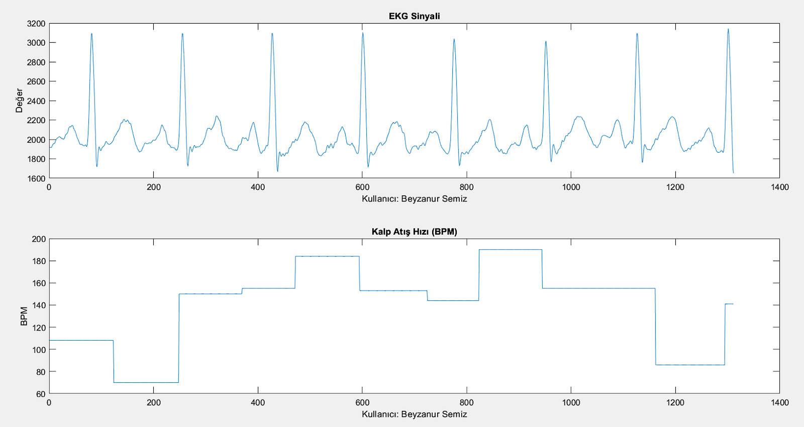

# PC-Based Portable ECG Monitoring System

This project is a low-cost, portable Electrocardiogram (ECG) monitoring system designed to detect heart signals, calculate heart rate (BPM) in real-time, and visualize the data on a PC.

Using an **STM32 Nucleo-64** microcontroller and an **AD8232** sensor, the system captures physiological signals, processes them digitally, and transmits them to a **MATLAB** interface for analysis and recording.

## Features
* **Real-Time Monitoring:** Instant visualization of ECG waveforms and BPM via MATLAB.
* **Signal Processing:** On-chip signal smoothing (Moving Average Filter) and R-peak detection algorithms running on STM32.
* **High Resolution:** Utilizes 12-bit ADC resolution for precise signal acquisition.
* **Data Logging:** Automatically saves patient data (Name, Surname, Timestamp, ECG values) to `.txt` files for medical archiving.
* **Portable Design:** Built on the efficient STM32L476RG architecture.

## Hardware & Tech Stack
* **Microcontroller:** STM32 Nucleo-64 (STM32L476RG - ARM Cortex-M4)
* **Sensor:** AD8232 Heart Rate Monitor Module
* **Firmware:** C++ (Arduino IDE with STM32 Core)
* **Software:** MATLAB (Serial Communication & Data Visualization)
* **Communication:** UART (Serial) @ 115200 baud rate

## How It Works

### 1. Data Acquisition & Firmware (STM32)
The STM32 microcontroller reads analog signals from the AD8232 sensor connected to pin **PA0**.
* **Filtering:** A moving average filter (`FILTER_SIZE = 10`) is applied to reduce noise and smooth the raw signal.
* **BPM Calculation:** The algorithm detects R-peaks using a threshold method (`THRESHOLD > 2000`). It calculates the time difference between beats to determine the Beats Per Minute (BPM).
* **Debouncing:** A 300ms debounce timer is implemented to prevent false positive beat detections.

### 2. Visualization & Logging (MATLAB)
The MATLAB script connects to the serial port to receive the data stream (`ECG,BPM`).
* **User Interface:** Prompts the user for patient Name/Surname.
* **Plotting:** Draws two subplots in real-time:
    1.  Raw ECG Signal
    2.  Heart Rate (BPM) trends
* **Storage:** Saves the session data into a uniquely named text file (e.g., `Name_Surname_Date.txt`).

## 🔌 Pin Connections

| AD8232 Pin | STM32 Nucleo Pin |
| :--- | :--- |
| **OUTPUT** | **PA0 (A0)** |
| **3.3V** | **3V3** |
| **GND** | **GND** |
| **LO+** | **(Not Used)** |
| **LO-** | **(Not Used)** |

## 📊 Screenshots

**ECG Signal and Heart Rate (BPM) Plot:**

**MATLAB Interface and Data Logging:**

